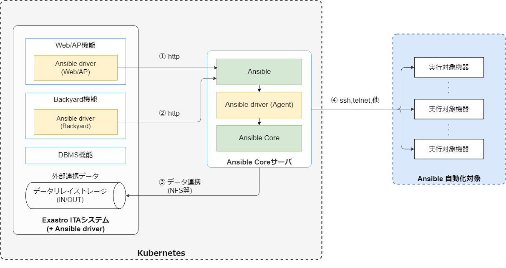
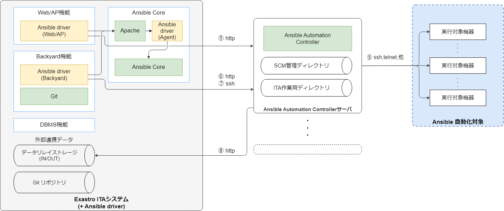
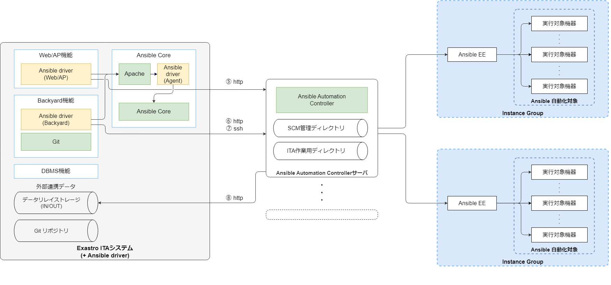
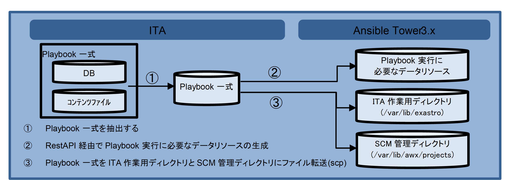
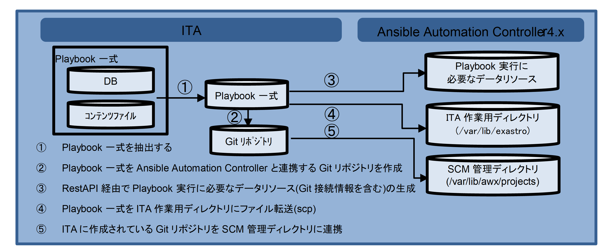
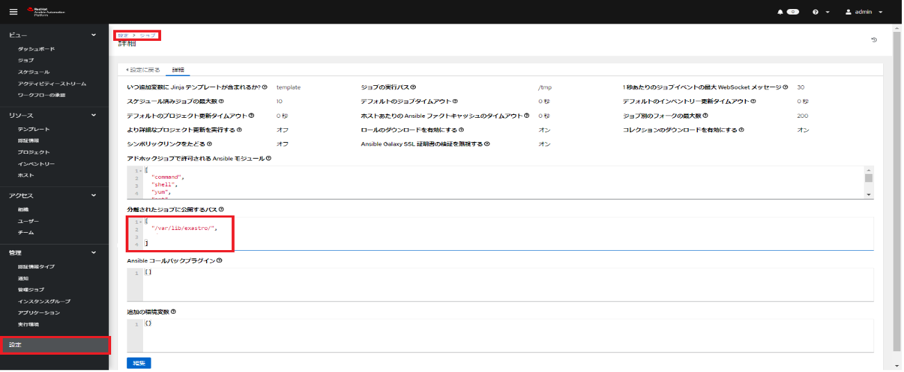

========================================================
ITA_システム構成/環境構築ガイド Ansible-driver編
========================================================

はじめに
========================================================
| 本書では、ITAでAnsibleオプション機能（以下、Ansible driver）として運用する為のシステム構成と環境構築について説明します。
| ITA Ansible driverを利用するにあたっては、ITA基本機能が構築済であることが前提です。
| ITA基本機能の構築に関しては、「 :doc:`../it_automation_base/architecture` 」をご覧ください。

機能
========================================================
| Ansible driverは以下の機能を提供します。

.. table::  機能名
   :align: left

   +----+---------------------------------+--------------------------------+----------------------------------+-------------------------------------+
   | No | 機能名                          | 用途                           | WEBコンテンツ                    | Backyardコンテンツ                  |
   +====+=================================+================================+==================================+=====================================+
   | 1  | Ansible driver                  | ITAからAnsible Core かAnsible\ | 〇                               | 〇                                  |
   |    |                                 | Automation Controller\         |                                  |                                     |
   |    |                                 | を介してサーバ、ストレージ、\  |                                  |                                     |
   |    |                                 | ネットワーク機器の構成管理を\  |                                  |                                     |
   |    |                                 | 行う                           |                                  |                                     |
   +----+---------------------------------+--------------------------------+----------------------------------+-------------------------------------+
   | 2  | Ansible driver (Agent)          | Ansible Coreを外部から操作\    | 〇                               | －                                  |
   |    |                                 | を外部から操作するため\        |                                  |                                     |
   |    |                                 | のRestAPIを提供するコンテンツ  |                                  |                                     |
   |    |                                 |                                |                                  |                                     |
   +----+---------------------------------+--------------------------------+----------------------------------+-------------------------------------+

システム構成
========================================================

システム構成
--------------------------------------------------------

| Ansible driver機能のシステム構成は、ITAシステムと同じです。
|
| Ansible driver（Agent）機能は、Apache、PHP、Ansible Core と構成する必要があります、専用サーバを用意するか、ITAシステムにコンソリデーションすることが可能です。
| Ansible Automation Controllerにより、Ansible実行における拡張された機能の利用や、可用性を高めた構成で運用することが可能です。
|
| ITAシステムおよびAnsible Coreとは個別の専用サーバを用意する必要があります。
| また実行するplaybookをAnsible Vaultで暗号化するため、Ansible Core [Ansible Driver (Agent)]が必要となります。 (Backyardサーバとコンソリデーションすることも可能)
|
| Ansible実行の対象機器の接続台数が多く、Ansible実行サーバのスケールアウトが必要な場合、Ansible Automation Controllerによる構成を推奨します。
| 以下に主なAnsible driver機能利用の構成パターンと構成イメージを記載します。
| ※ITAシステムは省略した構成図を記載。詳細は「 :doc:`../it_automation_base/architecture` 」を参照してください。
|

.. table::  システム構成パターン
   :align: Left

   +------------+-------------------------------+--------------------------------------------------------------------------------+---------------------------+
   | No         | 構成                          | 説明                                                                           | Ansibleスケールアウト可否 |
   +============+===============================+================================================================================+===========================+
   | 1          | オールインワン構成            | ITAシステムとAnsible Core [Ansible Driver (Agent)] を同一サーバ上に構成        | ×                         |
   |            |                               |                                                                                |                           |
   +------------+-------------------------------+--------------------------------------------------------------------------------+---------------------------+
   | 2          | Ansible Core分離構成          | ITAシステムと個別に構築したAnsible Core [Ansible Driver (Agent)] との連携構成  | ×                         |
   |            |                               |                                                                                |                           |
   +------------+-------------------------------+--------------------------------------------------------------------------------+---------------------------+
   | 3          | Ansible Automation Controlle\ | ITAシステム (Ansible Core/Ansible Driver (Agent)) と Ansible Automation Contr\ | 〇                        |
   |            | r構成                         | ollerの連携構成                                                                |                           |
   |            |                               |                                                                                |                           |
   +------------+-------------------------------+--------------------------------------------------------------------------------+---------------------------+

オールインワン構成イメージ
~~~~~~~~~~~~~~~~~~~~~~~~~~~~~~~~~~~~~~~~~~~~~~~~~~~~~~~~

Ansible Automation Controller 構成イメージ
~~~~~~~~~~~~~~~~~~~~~~~~~~~~~~~~~~~~~~~~~~~~~~~~~~~~~~~~

Ansible Automation Controller + AEE 構成イメージ 
~~~~~~~~~~~~~~~~~~~~~~~~~~~~~~~~~~~~~~~~~~~~~~~~~~~~~~~~

システムの通信要件
--------------------------------------------------------

| 本システム構成において、各サービス間の通信要件は以下の通りです。
| ITAシステム本体の通信要件の詳細は「 :doc:`../it_automation_base/architecture` 」を参照してください。
| 

.. ①も半角扱い

.. table:: 通信要件一覧
   :align: Left

   +-----------------------------+------------------+------------------+--------------------------+------------------------------------------------+
   | **通信番号**                | **FROM**         | **TO**           | **プロトコル**           | **主な用途**                                   |
   |                             |                  |                  |                          |                                                |
   | **※１**                     |                  |                  | **[ポート番号 ※２]**     |                                                |
   +=============================+==================+==================+==========================+================================================+
   | ①                           | ITAサーバ        | Ansible Core     | http(s)                  | REST APIリクエストを投入する(緊急停止)         |
   |                             |                  |                  |                          |                                                |
   |                             | (Web/AP 機能)    |                  | [80(443)/tcp]            |                                                |
   +-----------------------------+------------------+------------------+--------------------------+------------------------------------------------+
   | ②                           | ITAサーバ        | Ansible Core     | http(s)                  | REST APIリクエストを投入する(処理実行等)       |
   |                             |                  |                  |                          |                                                |
   |                             | (Backyard 機能)  |                  | [80(443)/tcp]            |                                                |
   +-----------------------------+------------------+------------------+--------------------------+------------------------------------------------+
   | ③                           | Ansible Core     | ストレージ機器   | ファイルアクセス         | Ansible コマンド実行時の実行情報               |
   |                             |                  |                  |                          |                                                |
   |                             |                  |                  | (tcp or ストレージ I/O)  | (Playbook , host_vars 等)の参照                |
   +-----------------------------+                  +------------------+--------------------------+------------------------------------------------+
   | ④                           |                  | 対象機器         | Any                      | 自動構成の対象機器へのコマンド実行　           |
   |                             |                  |                  |                          |                                                |
   |                             |                  |                  | (ssh [22/tcp ] \         |                                                |
   |                             |                  |                  | telnet [23/tcp] 等 ※３)  |                                                |
   +-----------------------------+------------------+------------------+--------------------------+------------------------------------------------+
   | ⑤                           | ITAサーバ        | Ansible Automat\ | http(s)                  | REST APIリクエストを投入する(緊急停止)         |
   |                             |                  | ion Controller   |                          |                                                |
   |                             | (Web/AP 機能)    |                  | [80(443)/tcp]            |                                                |
   +-----------------------------+------------------+                  +--------------------------+------------------------------------------------+
   | | ⑥                         | ITAサーバ        |                  | http(s)                  | REST APIリクエストを投入する                   |
   | |                           |                  |                  |                          |                                                |
   |                             | (Backyard 機能)  |                  | [80(443)/tcp]            | (実行データリソース作成／処理実行等)           |
   |                             |                  |                  +--------------------------+------------------------------------------------+
   | | ⑦                         |                  |                  | ssh [22/tcp]             | Ansible コマンド実行時の実行情報               |
   |                             |                  |                  |                          |                                                |
   |                             |                  |                  |                          | (Playbook , host_vars 等)をITA作業用ディレク\  |
   |                             |                  |                  |                          | トリに転送 (scp)                               |
   +-----------------------------+------------------+------------------+--------------------------+------------------------------------------------+
   | | ⑧                         | Ansible Automa\  | ITAサーバ        | ssh [22/tcp]             | ITAに作成されている Gitリポジトリを SCM管理\   |
   | |                           | tion Controller  |                  |                          | ディレクトリに連携 (git clone)                 |
   |                             |                  | (Backyard 機能)  |                          |                                                |
   |                             |                  +------------------+--------------------------+------------------------------------------------+
   | | ⑨                         |                  | 対象機器         | Any                      | 自動構成の対象機器へのコマンド実行             |
   |                             |                  |                  |                          |                                                |
   |                             |                  |                  | (ssh [22/tcp ] \         |                                                |
   |                             |                  |                  | telnet [23/tcp] 等 ※３)  |                                                |
   +-----------------------------+------------------+------------------+--------------------------+------------------------------------------------+

| ※1「2.1システム構成」の構成イメージに上記番号と紐づく通信番号を記載。
| ※2 ポート番号は標準的なポート番号を記載。
| ※3 代表的な例を記載。Ansibleモジュールにより利用プロトコルが異なる。

システム要件
========================================================

| Ansible driver はITAシステムのシステム要件に準拠するため、「 :doc:`../it_automation_base/architecture` 」を参照してください。
| ここではBackyard、Ansible Core、Ansible Automation Controllerの要件を記載します。

Backyard
--------------------------------------------------------

.. list-table:: Ansible Backyard必要Linuxコマンド
   :widths: 45 120 
   :header-rows: 1
   :align: left

   * - **コマンド**
     - **注意事項**
   * - zip
     - 

.. list-table:: Ansible BackYard必要外部モジュール
   :widths: 35 20 45 
   :header-rows: 1
   :align: left

   * - **外部モジュール**
     - **バージョン**
     - **注意事項**
   * - php-yaml
     - 2.1.0 以上
     - 

Ansible Core
-------------------------------------------------------------

.. list-table:: Ansible Core システム要件
   :widths: 35 20 45 
   :header-rows: 1
   :align: left

   * - **パッケージ**
     - **バージョン**
     - **注意事項**
   * - Ansible
     - 2.5 以上
     - 
   * - Python
     - 3.0 以上
     - 
   * - pywinrm
     - 
     - Python モジュールです。Yum でインストールできない場合、pip を使用してインストールしてください。
   * - Pexpect
     - 
     - Python モジュールです。
   * - talnet
     - ー
     - 構成対象に telnet 接続する場合に必要です。
   * - Apache
     - 2.4 系
     - | ITA システムと異なるサーバで運用の場合に必要です。
       | パッケージ/バージョンは ITA システムサーバに合わせてください。

.. list-table:: Ansible Driver必要Linuxコマンド
   :widths: 45 120 
   :header-rows: 1
   :align: left

   * - **コマンド**
     - **注意事項**
   * - expect
     - 

Ansible Automation Controller
-------------------------------------------------------------

.. list-table:: Ansible Automation Controllerシステム要件
   :widths: 35 20 45 
   :header-rows: 1
   :align: left

   * - **パッケージ**
     - **バージョン**
     - **注意事項**
   * - Ansible Tower
     - 3.5.0 以上
     - 3.5.0 以前のバージョンでユーザー/パスワードによる認証方式には対応できません。
   * - Ansible Automation Controller
     - 4.0.0 以上
     - 

Playbook連携
========================================================

| ITAとAnsible Core 及びAn
sible Automation Controller間のPlaybook連携について説明します。

.. figure:: ./architecture/image2a_1.png
   :alt: ITAとAnsible Core間のPlaybook連携図
   :width: 6.69236in
   :height: 2.92847in

   ITAとAnsible Core間のPlaybook連携図

   ITAとAnsible Tower3.x間のPlaybook連携図

| Ansible Tower3.xではSCMタイプを「手動」で行っていましたが、Ansible Automation Controller4.xではSCMタイプを「手動」にして各データリソース登録と実行を連続して行うと実行時にエラーとなる事象が発生するようになったため、Gitを介してPlaybook一式を連携するSCMタイプ「Git」に変更しています。

   ITAとAnsible Automation Controller4.x間のPlaybook連携図

初期設定
========================================================
| Ansible Core 及びAnsible Automation Controllerインストール後、実行エンジンに応じて各設定を行ってください。
| 

.. ×は個数分、半角うしろにずれる
.. table:: 実行エンジンに応じた設定一覧
   :align: Left

   +-------------------------------------------------------+---------------------------------------------------------------------------------------------------------+
   | 設定項目                                              | 実行エンジン                                                                                            |
   |                                                       +-----------------------------------+---------------------------------+-----------------------------------+
   |                                                       | Ansible Core                      | Ansible Tower3.x                | Ansible Automation Controller 4.x |
   |                                                       |                                   |                                 |                                   |
   +=======================================================+===================================+=================================+===================================+
   | 共有ディレクトリ                                      | 〇                                | ×                               | ×                                 |
   +-------------------------------------------------------+-----------------------------------+---------------------------------+-----------------------------------+
   | ITA作業用ディレクトリの準備                           | ×                                 | 〇                              | 〇                                |
   +-------------------------------------------------------+-----------------------------------+---------------------------------+-----------------------------------+
   | ITA作業用ディレクトリの公開                           | ×                                 | ×                               | 〇                                |
   +-------------------------------------------------------+-----------------------------------+---------------------------------+-----------------------------------+
   | Ansible Automation  Controllerへのファイル転送\       | ×                                 | 〇                              | 〇                                |
   | ユーザーの準備                                        |                                   |                                 |                                   |
   +-------------------------------------------------------+-----------------------------------+---------------------------------+-----------------------------------+
   | Ansible Automation Controllerと連携するGitへの\       | ×                                 | ×                               | 〇                                |
   | ユーザーの準備                                        |                                   |                                 |                                   |
   +-------------------------------------------------------+-----------------------------------+---------------------------------+-----------------------------------+
   | パッケージ確認                                        | ×                                 | 〇                              | ×                                 |
   +-------------------------------------------------------+-----------------------------------+---------------------------------+-----------------------------------+
   | 必要リソース準備                                      | ×                                 | 〇                              | 〇                                |
   +-------------------------------------------------------+-----------------------------------+---------------------------------+-----------------------------------+
   | Proxy設定                                             | ×                                 | ×                               | △                                 |
   +-------------------------------------------------------+-----------------------------------+---------------------------------+-----------------------------------+

| 〇:必須　×:不要　△:必要に応じて

共有ディレクトリの準備
-------------------------------------------------------------

| ITAとAnsible Coreからアクセス可能な共有ディレクトリを準備してください。
| ITAとAnsible Coreをインストール後、この共有ディレクトリをITAシステムに登録する必要があります。
| 「利用手順マニュアル_Ansible-driver」の「 :ref:`general_operations_interface_information` 」を参照し、登録を行ってください。

ITA作業用ディレクトリの準備
-------------------------------------------------------------

| Ansible Automation ControllerサーバにITA作業用ディレクトリを作成してください。
| クラスタ構成の場合は、構成している全てのサーバにディレクトリを作成してください。
| ただし、Ansible Automation Controllerのhop nodeにはディレクトリ作成不要です。
|

.. list-table:: ITA作業用ディレクトリの作成情報
   :widths: 35 120
   :header-rows: 1
   :align: left

   * - **項目**
     - **設定値**
   * - ディレクトリパス
     - /var/lib/exastro
   * - オーナー・グループ
     - awx:awx
   * - パーミッション
     - 0755

ITA作業用ディレクトリの公開
-------------------------------------------------------------

| ブラウザよりAnsible Automation Controllerにログインし、「設定」→「ジョブ」→「分離されたジョブに公開するパス」に「/var/lib/exastro/」を設定します。
| 

Ansible Automation Controllerへのファイル転送ユーザーの準備
-------------------------------------------------------------

| ITAからAnsible Automation ontrollerのプロジェクトを生成する際、Ansible Automation Controllerの下記ディレクトリにPlaybook一式をファイル転送します。ファイル転送するLinuxユーザーを準備してください。
|
| ・SCM管理ディレクトリ(/var/lib/awx/projects)
| 　※Ansible Tower3.xの場合にLinuxユーザーでPlaybook一式をファイル転送します。
| ・ITA作業用ディレクトリ(/var/lib/exastro)

| Linuxユーザーは、Ansible Automation Controllerインストール時に生成されるawxユーザーにパスワードを設定し使用することを強く推奨します。また、awxユーザー以外のユーザーを用意し使用する場合、SCM管理パス(/var/lib/awx/projects)のパーミッションの変更はRedhatのサポート対象外となりますのでご注意ください。
| 準備したLinuxユーザーは、ITAシステムに登録する必要があります。「利用手順マニュアル_Ansible-driver」の「Ansible Automation Controllerホスト一覧」を参照し、登録を行ってください。

Ansible Automation Controllerと連携するGitへのユーザーの準備
--------------------------------------------------------------
| ITAからAnsible Automation Controllerのプロジェクトを生成する際のSCMタイプをGitにしています。
| 連携先のGitリポジトリは、Ansible driverのバックヤード機能がインストールされているホストに作成されます。Ansible Automation Controllerから、このGitリポジトリにssh鍵認証で接続するLinuxユーザーを準備してください。
|
| 準備したLinuxユーザーは、ITAシステムに登録する必要があります。「利用手順マニュアル_Ansible-driver」の「インターフェース情報」の「SCM管理 Git連携先情報」を参照し、登録を行ってください。
| 尚、ITAインストーラを使用してITAインストールまたはV1.10.0以降へのバージョンアップをした場合、Gitリポジトリに接続するLinuxユーザーと鍵ファイルを生成し、「インターフェース情報」の「SCM管理 Git連携先情報」の「ユーザー」、「ssh秘密鍵ファイル」を初期設定しているため、個別に作成は不要です。「ホスト名」にAnsible driverのバックヤード機能がインストールされているホスト名（またはIPアドレス）を設定してください。
|
| 別のユーザーを使用する場合は、Linuxユーザーと鍵ファイルを生成し「インターフェース情報」の「SCM管理 Git連携先情報」を更新してください。
| 

.. list-table:: ITAインストール時に生成されるssh鍵認証用Linuxユーザー情報
   :widths: 35 200
   :header-rows: 1
   :align: left

   * - **項目**
     - **項目値**
   * - ユーザー
     - awx
   * - パスワード
     - 未設定
   * - 秘密鍵
     - /home/awx/.ssh/rsa_awx_key
   * - 公開鍵
     - /home/awx/.ssh/rsa_awx_key.pub

パッケージ確認
----------------

| Ansible-driverで必要なパッケージがインストールされているかを確認します。
| インストールされていない場合は、パッケージのインストールが必要です。

| ●必要なパッケージ
| 　pexpect
|
| ●確認方法

.. code-block:: none

  su - awx
  source /var/lib/awx/venv/ansible/bin/activate
  pip list
  deactivate

| ●インストール方法

.. code-block:: none

  su - awx
  source /var/lib/awx/venv/ansible/bin/activate
  umask 0022
  pip install --upgrade pexpect
  deactivate

必要リソース準備
------------------
| Ansible Automation Controllerに認証アプリケーションをあらかじめ登録しておく必要があります。
|

.. list-table:: Ansible Automation Controller 必要リソース一覧
   :widths: 20 30 30 50
   :header-rows: 1
   :align: left

   * - **種類**
     - **用途**
     - **名前**
     - **説明**
   * - アプリケーション
     - 認証アプリケーション
     - o_auth2_access_token
     - ITAからAnsible Automation ControllerにRestAPIで接続する場合の認証用のアプリケーション情報
   * - ユーザー
     - トークン
     - ー
     - ITAからAnsible Automation ControllerにRestAPIで接続するのに使用する接続トークン

アプリケーション 
~~~~~~~~~~~~~~~~~~~~~~
| ● Ansible Automation Controller設定値
-  名前 　　　　　　　： o_auth2_access_token
-  組織 　　　　　　　： Default
-  認証付与タイプ 　　： リソース所有者のパスワードベース
-  クライアントタイプ ： 機密

ユーザートークン
~~~~~~~~~~~~~~~~~~~~~
| ● Ansible Automation Controller設定値
-  APPLICATION 　　　： o_auth2_access_token
-  SCOPE 　　　　　　： 書き込み

.. warning:: 
  | Ansible Automation Controllerのログインに使用するユーザーでログインしておく必要があります。
  | 生成されたトークンは、Ansible共通コンソールのインタフェース情報の接続トークンに設定する必要があります。「利用手順マニュアル_Ansible-driver」の「 :ref:`general_operations_interface_information` 」を参照し、登録を行ってください。

Proxyの設定
-------------
| Ansible Automation Controllerの設定に応じて作業実行時などにRedhat社の所定のサイトより実行環境のコンテナイメージのダウンロードが行われます。
| ブラウザよりAnsible Automation Controllerにログインし、「設定」→「ジョブ」→「追加の環境変数」に下記の環境変数を設定します。
|
- 　https_proxy
- 　http_proxy
- 　no_proxy
- 　HTTPS_PROXY
- 　HTTP_PROXY
- 　NO_PROXY

|

.. image:: ./architecture/image5.png
   :width: 6.09896in
   :height: 2.68264in
   :align: center

|
|

.. warning::
  | Ansible Automation ControllerがProxy環境下にある場合、Ansible Automation ControllerにProxy設定が必要です。Proxyの設定がされていない状態で作業実行を行った場合、エラー原因が取得できない場合があります。
