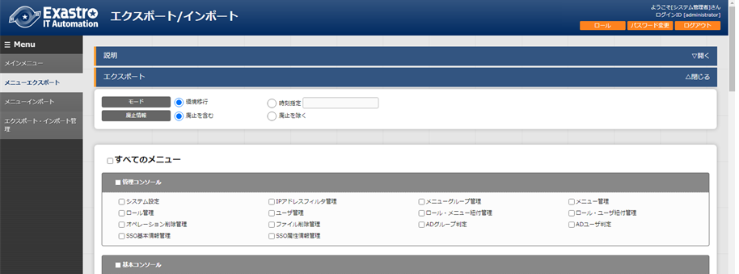
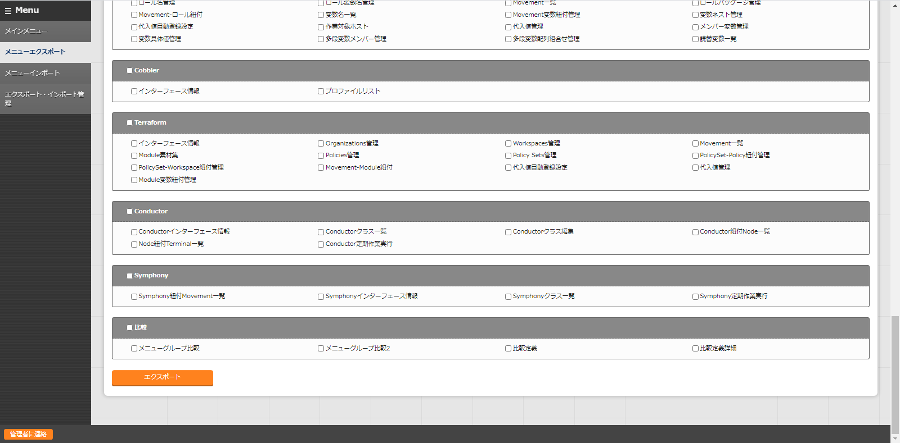
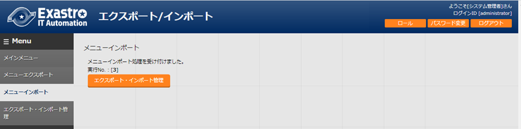
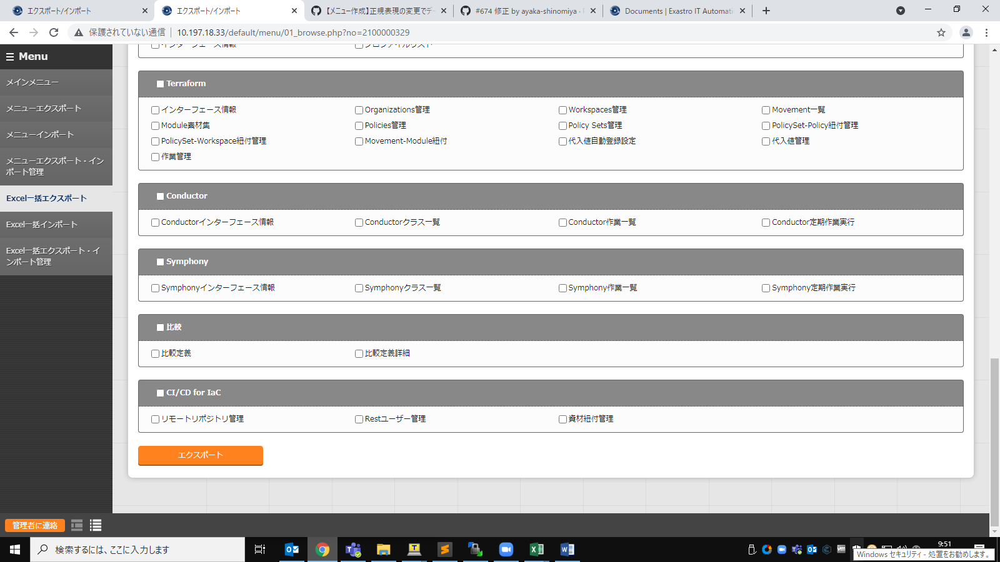

|image1|

|\\\abkfs04.nsl.ad.nec.co.jp\a06006-01\30_Exastro_IT-Automation\3_全社展開チーム(サ事開本)\FY2019_1-上期\81_Exastro正式素材集(ロゴ等)\PNG\Exastro_mark+type_1.png|

ITA_利用手順マニュアル

エクスポート/インポート

*－*\ 第1.11版\ *－*

Copyright © NEC Corporation 2019. All rights reserved.

免責事項

本書の内容はすべて日本電気株式会社が所有する著作権に保護されています。

本書の内容の一部または全部を無断で転載および複写することは禁止されています。

本書の内容は将来予告なしに変更することがあります。

日本電気株式会社は、本書の技術的もしくは編集上の間違い、欠落について、一切責任を負いません。

日本電気株式会社は、本書の内容に関し、その正確性、有用性、確実性その他いかなる保証もいたしません。

商標

-  LinuxはLinus
      Torvalds氏の米国およびその他の国における登録商標または商標です。

-  Red Hatは、Red Hat,
      Inc.の米国およびその他の国における登録商標または商標です。

-  Apache、Apache Tomcat、Tomcatは、Apache Software
      Foundationの登録商標または商標です。

-  Ansibleは、Red Hat, Inc.の登録商標または商標です。

-  AnsibleTowerは、Red Hat, Inc.の登録商標または商標です。

その他、本書に記載のシステム名、会社名、製品名は、各社の登録商標もしくは商標です。

なお、® マーク、TMマークは本書に明記しておりません。

※本書では「Exastro IT Automation」を「ITA」として記載します。

**目次**

`はじめに 4 <#はじめに>`__

`1 エクスポート/インポートの概要 5 <#エクスポートインポートの概要>`__

`1.1 メニューエクスポート・インポート
5 <#メニューエクスポートインポート>`__

`1.1.1 機能について 5 <#機能について>`__

`1.1.2 モードについて 6 <#モードについて>`__

`1.1.3 使用例 7 <#使用例>`__

`1.2 Excel一括エクスポート・インポート
9 <#excel一括エクスポートインポート>`__

`1.2.1 機能について 9 <#機能について-1>`__

`2 エクスポート/インポートのメニュー、画面構成
10 <#エクスポートインポートのメニュー画面構成>`__

`2.1 メニュー 一覧 10 <#_Toc77166539>`__

`3 機能・操作方法説明 11 <#機能操作方法説明>`__

`3.1 メニューエクスポート 11 <#メニューエクスポート>`__

`3.2 メニューインポート 14 <#メニューインポート>`__

`3.3 メニューエクスポート・インポート管理
16 <#メニューエクスポートインポート管理>`__

`3.4 Excel一括エクスポート 17 <#excel一括エクスポート>`__

`3.5 Excel一括インポート 20 <#excel一括インポート>`__

`3.6 Excel一括エクスポート・インポート管理
22 <#excel一括エクスポートインポート管理>`__

はじめに
========

本書は、ITAのエクスポート/インポートの機能および操作方法について説明します。

エクスポート/インポートの概要
=============================

本章ではエクスポート/インポートについて説明します。

メニューエクスポート・インポート
--------------------------------

機能について
~~~~~~~~~~~~

メニューエクスポート・インポートは、移行したいITAのメニューを選択し、メニュー単位でデータを上書きで移行します。

モードについて
~~~~~~~~~~~~~~

メニューエクスポート機能には2種類のモードがあります。

#. **環境移行**

..

   指定メニューのすべてのデータをエクスポートします。インポート先のデータをすべて置き換えます。

2. **時刻指定**

..

   指定時刻以降のデータのみエクスポートします。インポート先のデータと一意項目（ID、No等）が重複した場合はエクスポートしたデータが優先してインポートされます。

   例：2021年1月2日 17:00を指定した場合

   |image2|

   |image3|

使用例
~~~~~~

本機能ではITAサーバAとITAサーバBの2つの環境を使用して、以下のように機能を利用することを想定しています。

　　**パターン①：環境の複製**

ITAサーバAに登録されているすべてのデータをITAサーバBに複製します。

[手順]

#. 環境移行モードにてITAサーバAのデータを環境移行モードですべてエクスポートします。

#. １でエクスポートしたデータをITAサーバBにインポートします。

..

   ※環境移行後はITAサーバBでデータの登録・更新を行えます。その後、再度ITAサーバAからデータを移行すると不整合が発生する可能性があるため非推奨です。

※双方向でのデータの移行は、データの不整合が発生する可能性があるため非推奨です。

　　　**パターン②：データを投入するサーバと作業を実行するサーバを分ける**

データの投入・テスト用サーバと作業の実行のみを行う用のサーバの2点を用意する場合。

[手順]

#. 環境移行モードにてITAサーバAのデータをすべてエクスポートします。

#. １でエクスポートしたファイルをITAサーバBにインポートします。

#. ITAサーバAでデータの更新があるたびにITAサーバBに時刻指定モードで差分データを移行します。

..

   ※データ移行を複数行う前提の場合、データの登録・更新を行うとデータの不整合が発生する可能性があるため非推奨です。作業の実行のみであれば影響はありません。

   ※サーバBにて作業の実行中にデータを移行する際は、実行中のデータに影響を与えないようにするため、時刻指定モードで差分データのみを移行するようにしてください。

   ※双方向でのデータの移行は、データの不整合が発生する可能性があるため非推奨です。

Excel一括エクスポート・インポート
---------------------------------

.. _機能について-1:

機能について
~~~~~~~~~~~~

Execl一括エクスポート・インポートは、各メニューにあるダウンロード可能なファイル（Excel/独自フォーマットのCSV）をzipファイルにまとめて一括でエクスポート・インポートを行うものです。ダウンロード可能なファイルについては『Exastro-ITA_利用手順マニュアル_管理コンソール』を参照してください。

エクスポート可能なメニューは[ロール・メニュー紐付管理]メニューにて『紐付け』項目が『閲覧のみ』もしくは『メンテナンス可』のデータのみです。

インポート可能なメニューは[ロール・メニュー紐付管理]メニューにて『紐付け』項目が『メンテナンス可』のデータのみです。

エクスポート/インポートのメニュー、画面構成
===========================================

本章では、エクスポート/インポートのメニュー、画面構成について説明します

1. 

メニュー 一覧
-------------

   エクスポート/インポートのメニューを以下に示します。

**表 2-1 ITAメニュー一覧**

+--------+------------------+------------------+------------------+
| **No** | **メニュー**     | **               | **説明**         |
|        |                  | メニュー・画面** |                  |
|        | **グループ**     |                  |                  |
+========+==================+==================+==================+
| 1      | エクスポ         | メニ             | メニュ           |
|        | ート/インポート  | ューエクスポート | ーのデータをエク |
|        |                  |                  | スポートします。 |
+--------+------------------+------------------+------------------+
| 2      |                  | メ               | メニ             |
|        |                  | ニューインポート | ューのデータをイ |
|        |                  |                  | ンポートします。 |
+--------+------------------+------------------+------------------+
| 3      |                  | メニ             | [メニューエクス  |
|        |                  | ューエクスポート | ポート]メニュー  |
|        |                  | ・インポート管理 | で実行したエクス |
|        |                  |                  | ポートと、[メニ  |
|        |                  |                  | ューインポート]  |
|        |                  |                  | メニューで実行し |
|        |                  |                  | たインポートの状 |
|        |                  |                  | 況を管理します。 |
+--------+------------------+------------------+------------------+
| 4      |                  | Excel            | 各メニューにあ   |
|        |                  | 一括エクスポート | るダウンロード可 |
|        |                  |                  | 能なファイルをz  |
|        |                  |                  | ipにまとめ、エク |
|        |                  |                  | スポートします。 |
+--------+------------------+------------------+------------------+
| 5      |                  | Exc              | ダウンロード     |
|        |                  | el一括インポート | 可能なファイルを |
|        |                  |                  | まとめたzipをイ  |
|        |                  |                  | ンポートします。 |
+--------+------------------+------------------+------------------+
| 6      |                  | Excel            | [Excel一括エクス |
|        |                  | 一括エクスポート | ポート]メニュー  |
|        |                  | ・インポート管理 | で実行したエクス |
|        |                  |                  | ポートと、[Exce  |
|        |                  |                  | l一括インポート] |
|        |                  |                  | メニューで実行し |
|        |                  |                  | たインポートの状 |
|        |                  |                  | 況を管理します。 |
+--------+------------------+------------------+------------------+

機能・操作方法説明
==================

メニューエクスポート
--------------------

   ITAシステムに登録されているデータを、メニューごとにエクスポートします。

-  データを別のITA環境に移す場合、すべてのメニューを対象に移動しないとデータの整合性が壊れる

..

   可能性があります。

-  一部エクスポート対象外のメニューが存在します。対象外のメニューは以下の通りです。

+--------+------------+------------+----+------------+------------+
| **No** | **         | **メニュ   | No | **         | **メニュ   |
|        | メニュー** | ー・画面** |    | メニュー** | ー・画面** |
|        |            |            |    |            |            |
|        | **         |            |    | **         |            |
|        | グループ** |            |    | グループ** |            |
+========+============+============+====+============+============+
| 1      | 管理       | シー       | 25 | 比較       | 比較実行   |
|        | コンソール | ケンス管理 |    |            |            |
+--------+------------+------------+----+------------+------------+
| 2      |            | バー       | 26 | Ansi       | 作業実行   |
|        |            | ジョン情報 |    | ble-Legacy |            |
+--------+------------+------------+----+------------+------------+
| 3      | 基本       | ER図表示   | 27 |            | 作         |
|        | コンソール |            |    |            | 業状態確認 |
+--------+------------+------------+----+------------+------------+
| 4      | エク       | メニューエ | 28 |            | 作業管理   |
|        | スポート/  | クスポート |    |            |            |
|        | インポート |            |    |            |            |
+--------+------------+------------+----+------------+------------+
| 5      |            | メニュー   | 29 | Ansib      | 作業実行   |
|        |            | インポート |    | le-Pioneer |            |
+--------+------------+------------+----+------------+------------+
| 6      |            | メニュ     | 30 |            | 作         |
|        |            | ーエクスポ |    |            | 業状態確認 |
|        |            | ート・イン |    |            |            |
|        |            | ポート管理 |    |            |            |
+--------+------------+------------+----+------------+------------+
| 7      |            | E          | 31 |            | 作業管理   |
|        |            | xcel一括エ |    |            |            |
|        |            | クスポート |    |            |            |
+--------+------------+------------+----+------------+------------+
| 8      |            | Excel一括  | 32 | Ansible-   | 作業実行   |
|        |            | インポート |    | LegacyRole |            |
+--------+------------+------------+----+------------+------------+
| 9      |            | Excel一    | 33 |            | 作         |
|        |            | 括エクスポ |    |            | 業状態確認 |
|        |            | ート・イン |    |            |            |
|        |            | ポート管理 |    |            |            |
+--------+------------+------------+----+------------+------------+
| 10     | Symphony   | Move       | 34 |            | 作業管理   |
|        |            | mentインス |    |            |            |
|        |            | タンス一覧 |    |            |            |
+--------+------------+------------+----+------------+------------+
| 11     |            | Symphony   | 35 | Terraform  | 作業実行   |
|        |            | クラス編集 |    |            |            |
+--------+------------+------------+----+------------+------------+
| 12     |            | Sympho     | 36 |            | 作         |
|        |            | ny作業実行 |    |            | 業状態確認 |
+--------+------------+------------+----+------------+------------+
| 13     |            | Sympho     | 37 |            | 作業管理   |
|        |            | ny作業確認 |    |            |            |
+--------+------------+------------+----+------------+------------+
| 14     |            | Sympho     | 38 |            | 連携先Ter  |
|        |            | ny作業一覧 |    |            | raform管理 |
+--------+------------+------------+----+------------+------------+
| 15     | Conductor  | Conduct    | 39 | Ter        | 作業実行   |
|        |            | or作業実行 |    | raform-CLI |            |
+--------+------------+------------+----+------------+------------+
| 16     |            | Conduct    | 40 |            | 作         |
|        |            | or作業確認 |    |            | 業状態確認 |
+--------+------------+------------+----+------------+------------+
| 17     |            | Conduct    | 41 |            | 作業管理   |
|        |            | or作業一覧 |    |            |            |
+--------+------------+------------+----+------------+------------+
| 18     |            | Condu      |    |            |            |
|        |            | ctorインス |    |            |            |
|        |            | タンス一覧 |    |            |            |
+--------+------------+------------+----+------------+------------+
| 19     |            | Nodeインス |    |            |            |
|        |            | タンス一覧 |    |            |            |
+--------+------------+------------+----+------------+------------+
| 20     | メ         | メニュー   |    |            |            |
|        | ニュー作成 | 定義・作成 |    |            |            |
+--------+------------+------------+----+------------+------------+
| 21     |            | メニュ     |    |            |            |
|        |            | ー作成実行 |    |            |            |
+--------+------------+------------+----+------------+------------+
| 22     |            | メニュ     |    |            |            |
|        |            | ー作成履歴 |    |            |            |
+--------+------------+------------+----+------------+------------+
| 23     |            | 選択1      |    |            |            |
+--------+------------+------------+----+------------+------------+
| 24     |            | 選択2      |    |            |            |
+--------+------------+------------+----+------------+------------+

(1) エクスポートするモードと廃止情報を選択します。

..

   モード一覧と廃止情報一覧を以下に示します。

表 3‑1 モード一覧

+----------+----------------------------------------------------------+
| **名称** | **説明**                                                 |
+==========+==========================================================+
| 環境移行 | インポ                                                   |
|          | ート時、既存データをすべて削除してデータを上書きします。 |
+----------+----------------------------------------------------------+
| 時刻指定 | インポート時、指定した時刻以降に入力されたデータを各     |
|          | メニューの一意項目（ID、No等）を基に挿入・上書きします。 |
+----------+----------------------------------------------------------+

表 3‑2 廃止情報一覧

========== ==========================================================
**名称**   **説明**
========== ==========================================================
廃止を含む 廃止状態のデータを含むすべてのデータをエクスポートします。
廃止を除く 廃止状態のデータを除いたデータをエクスポートします。
========== ==========================================================

(2) エクスポートするメニューを選択します。

..

   |image4|

   |image5|

   |image6|

図 3‑1 メニューエクスポート画面(1)

(3) メニューを選択後、《エクスポート》ボタンを押下します。

..

   エクスポート処理の実行№が表示されるので、メニューエクスポート・インポート管理画面で処理のステータスを確認してください。

   |image7|

図 3‑2 メニューエクスポート画面(2)

メニューインポート
------------------

   [メニューエクスポート]メニューでエクスポートしたデータをインポートします。

(1) インポートするファイルを選択して《アップロード》ボタンを押下します。

..

   |image8|

図 3‑3 メニューインポート画面(1)

(2) インポートしたファイル内のメニューの一覧が表示されます。インポートするメニューを選択して《インポート》ボタンを押下します。

..

   | チェックボックスがチェックされているメニューがインポートされます。
   | インポートする必要がないメニューは、チェックは外してください。

   |image9|\ |image10|

|image11|

図 3‑4メニューインポート画面(2)

(3) 受付画面に遷移します。《エクスポート・インポート管理》ボタンを押下すると、[メニューエクスポート・インポート管理]メニューに遷移してインポートの状況確認が行えます。

..

   |image12|

図 3‑5 メニューインポート画面(3)

メニューエクスポート・インポート管理
------------------------------------

   [メニューエクスポート]メニューで実行したエクスポートと、[メニューインポート]メニューで実行したインポートの状況を管理します。ログインユーザが実行したデータのみ表示されます。

   |image13|

図 3‑6 メニューエクスポート・インポート管理画面

表 3‑3 一覧画面項目一覧（メニューエクスポート・インポート管理）

+------------+--------------------------------------------------------+
| **項目**   | **説明**                                               |
+============+========================================================+
| 実行No.    | 一意のIDが自動採番されます                             |
+------------+--------------------------------------------------------+
| ステータス | 〔未実行〕、〔実行中〕、〔完了〕の順に遷移します。     |
|            |                                                        |
|            | エラーが発生した場合は、〔完了(異常)〕になります。     |
+------------+--------------------------------------------------------+
| 処理種別   | エクスポート・・・メニューエクスポート                 |
|            |                                                        |
|            | インポート・・・メニューインポート                     |
+------------+--------------------------------------------------------+
| モード     | 〔環境移行〕または〔時刻指定〕が表示されます。         |
+------------+--------------------------------------------------------+
| 廃止情報   | 〔廃止を含む〕または〔廃止を除く〕が表示されます。     |
+------------+--------------------------------------------------------+
| 指定時刻   | モードが〔時刻指定〕の場合にのみ表示されます。         |
+------------+--------------------------------------------------------+
| ファイル名 | エクスポートの場合、〔完了〕になるとエクスポートデー   |
|            | タが表示されるので、ダウンロードして使用してください。 |
|            |                                                        |
|            | インポートの場合、インポートしたデータが表示されます。 |
+------------+--------------------------------------------------------+
| 実行ユーザ | エクスポート処                                         |
|            | 理またはインポート処理を実行したユーザが表示されます。 |
|            |                                                        |
|            | 1.7.2以前から1.8.0以降にバージ                         |
|            | ョンアップした場合は『実行ユーザ』項目が追加されます。 |
|            |                                                        |
|            | 『実行ユーザ』項目が空または                           |
|            | ログインユーザと一致している場合データが表示されます。 |
+------------+--------------------------------------------------------+

Excel一括エクスポート
---------------------

   各メニューにあるダウンロード可能なファイルをzipにまとめ、エクスポートします。

(1) エクスポートする廃止情報を選択します。

..

   廃止情報一覧を以下に示します。

表 3‑4 廃止情報一覧

========== ====================================================
**名称**   **説明**
========== ====================================================
全レコード すべてのデータをエクスポートします。
廃止を除く 廃止状態のデータを除いたデータをエクスポートします。
廃止のみ   廃止状態のデータのみエクスポートします。
========== ====================================================

(2) エクスポートするメニューを選択します。

..

   表示されるメニューは[ロール・メニュー紐付管理]メニューの『紐付』項目が『メンテナンス可』もしくは『閲覧のみ』となっているデータのみです。

   |image14|\ |image15|

   |image16|

図 3‑7 Excel一括エクスポート画面(1)

(3) メニューを選択後、《エクスポート》ボタンを押下します。

..

   エクスポート処理の実行№が表示されるので、[Excel一括エクスポート・インポート管理]メニューで処理のステータスを確認してください。

|image17|

図 3‑8 Excel一括エクスポート画面(2)

(4) エクスポートしたファイルの中身は以下の通りです。

..

   ファイル構成

+------------------------------------------+
| ITA_FILES_YYYYMMDDhhmmss.zip …①          |
|                                          |
| ├─ MENU_LIST.txt …②                      |
|                                          |
| ├─ 2100000002_管理コンソール …③          |
|                                          |
| │　 ├─ ユーザ管理_20210708235958.xlsx …④ |
|                                          |
| │ └─ メニュー管理_20210708235959.xlsx …④ |
|                                          |
| ├─ 2100000003_基本コンソール             |
|                                          |
| │ ├─ 機器一覧_20210708235858.scsv …④     |
|                                          |
| │ └─ 機器一覧_20210708235859.xlsx …⑤     |
|                                          |
| └─ editBaker …⑥                          |
+==========================================+
|                                          |
+------------------------------------------+
|                                          |
+------------------------------------------+

+--------+----------------------+------------+----------------------+
| **No** | **名称**             | **拡張子** | **説明**             |
+========+======================+============+======================+
| #.     | ファイル名           | ファイル   | ファイル名は         |
|        |                      |            |                      |
|        |                      |            | 『ITA_FILES_YYYYMM   |
|        |                      |            | DDhhmmss.zip』です。 |
+--------+----------------------+------------+----------------------+
| 2.     | MENU_LIST.txt        | txt        | エ                   |
|        |                      |            | クスポートしたメニュ |
|        |                      |            | ーＩＤとファイル名の |
|        |                      |            | 一覧が出力されます。 |
+--------+----------------------+------------+----------------------+
| 3.     | メニ                 | フォルダ   | メニューグループ     |
|        | ューグループフォルダ |            | ごとに生成されます。 |
|        |                      |            |                      |
|        |                      |            | フォルダ名は『メニュ |
|        |                      |            | ーグループID_メニュ  |
|        |                      |            | ーグループ名』です。 |
|        |                      |            |                      |
|        |                      |            | フォルダ             |
|        |                      |            | 名が200文字を超える  |
|        |                      |            | 場合は前方から200文  |
|        |                      |            | 字のみ出力されます。 |
+--------+----------------------+------------+----------------------+
| 4.     | ダウンロードファイル | xlsx/scsv  | Ｅｘｃｅｌまたは     |
|        |                      |            | 独自フォーマットのＣ |
|        |                      |            | ＳＶとして出力されま |
|        |                      |            | す。（『各メニュー項 |
|        |                      |            | 目一覧』が[メニュー  |
|        |                      |            | 管理]メニューの『Exc |
|        |                      |            | el出力最大行数』を超 |
|        |                      |            | えている場合、独自フ |
|        |                      |            | ォーマットのＣＳＶと |
|        |                      |            | して出力されます。） |
|        |                      |            |                      |
|        |                      |            | 所属するメニ         |
|        |                      |            | ューグループフォルダ |
|        |                      |            | の下に配置されます。 |
+--------+----------------------+------------+----------------------+
| 5.     | 独自フォーマット編   | xlsx       | 独自フォーマット     |
|        | 集Ｅｘｃｅｌ作成素材 |            | のＣＳＶを編集する際 |
|        |                      |            | に使用する素材です。 |
|        |                      |            |                      |
|        |                      |            | 出力ファイ           |
|        |                      |            | ルに独自フォーマット |
|        |                      |            | のＣＳＶが含まれる場 |
|        |                      |            | 合のみ出力されます。 |
+--------+----------------------+------------+----------------------+
| 6.     | editBaker            | フォルダ   | 独自フ               |
|        |                      |            | ォーマット編集Ｅｘｃ |
|        |                      |            | ｅｌ作成ツールです。 |
|        |                      |            |                      |
|        |                      |            | 出力ファイ           |
|        |                      |            | ルに独自フォーマット |
|        |                      |            | のＣＳＶが含まれる場 |
|        |                      |            | 合のみ出力されます。 |
+--------+----------------------+------------+----------------------+

Excel一括インポート
-------------------

   [Excel一括エクスポート]メニューでエクスポートしたデータを編集し、インポートします。

#. Zipファイルの編集

(1) インポートするファイルリストを作成します。

   [Excel一括エクスポート]メニューでエクスポートしたzip内にあるMENU_LIST.txtを編集することによってインポートするファイルリストを編集することができます。

   MENU_LIST.txtはエクスポートした時点のメニューIDとファイル名が記載されています。

   『#』から始まる行はコメントとして入力することができます。

   フォーマットは以下の通りです。

   メニューID:ファイル名

   |image18|

図 3‑9 MENU_LIST.txt

   ※インポートするメニューは[Excel一括インポート]メニューでも選択可能です。

(2)
インポートするファイル（Excelまたは独自フォーマットのCSV）を編集します。

(3) 編集したファイルをzipにまとめます。

インポートに必要なファイルは以下の通りです。

・MENU_LIST.txt

・インポートするファイル（Excelまたは独自フォーマットのCSV）

2. インポート処理

   1. 《ファイル選択》ボタンを押下し、インポートするzipをアップロードします。

|image19|

図 3‑10 Excel一括インポート画面(1)

2. インポートしたファイル内のメニューの一覧が表示されます。インポートするメニューを選択して《インポート》ボタンを押下します。

..

   チェックボックスがチェックされているメニューがインポートされます。

   MENU_LIST.txtに記載されてあるファイルが上から順にインポートされます。

   インポートする必要がないメニューは、チェックは外してください。

   |image20|

図 3‑11 Excel一括インポート画面(2)

以下の条件に当てはまる場合、エラーとなりチェックボックスが非活性化されます。

１．MENU_LIST.txtに２つ以上同じＩＤを指定する

２．MENU_LIST.txtに２つ以上の別メニューＩＤに同じファイル名を指定する

３．MENU_LIST.txtのフォーマットに沿ってない記述がある

４．MENU_LIST.txtで存在しないメニューＩＤを記載する

５．MENU_LIST.txtでインポートしたzip内に存在しないファイルを指定する

６．別のフォルダに同名のファイルが２つ以上ある

７．対象メニューに対しログインユーザが『メンテナンス可』の権限を有していない

3. 受付画面に遷移します。《Excel一括エクスポート・インポート管理》ボタンを押下すると、[Excel一括エクスポート・インポート管理]メニューに遷移してインポートの状況確認が行えます。

..

   |image21|

図 3‑12 Excel一括インポート画面(3)

Excel一括エクスポート・インポート管理
-------------------------------------

   [Excel一括エクスポート]メニューで実行したエクスポートと、[Excel一括インポート]メニューで実行したインポートの状況を管理します。ログインユーザが実行したデータのみ表示されます。

|image22|

図 3‑13 Excel一括エクスポート・インポート管理画面

表 3‑5 一覧画面項目一覧（メニューエクスポート・インポート管理）

+------------+--------------------------------------------------------+
| **項目**   | **説明**                                               |
+============+========================================================+
| 実行No.    | 一意のIDが自動採番されます                             |
+------------+--------------------------------------------------------+
| ステータス | 〔未実行〕、〔実行中〕、〔完了〕の順に遷移します。     |
|            |                                                        |
|            | エラーが発生した場合は、〔完了(異常)〕になります。     |
+------------+--------------------------------------------------------+
| 処理種別   | エクスポート・・・Excel一括エクスポート                |
|            |                                                        |
|            | インポート・・・Excel一括インポート                    |
+------------+--------------------------------------------------------+
| 廃止情報   | 〔全レコー                                             |
|            | ド〕、〔廃止を除く〕または〔廃止のみ〕が表示されます。 |
+------------+--------------------------------------------------------+
| 実行ユーザ | エクスポート処                                         |
|            | 理またはインポート処理を実行したユーザが表示されます。 |
+------------+--------------------------------------------------------+
| ファイル名 | エクスポートの場合、〔完了〕になるとエクスポートデー   |
|            | タが表示されるので、ダウンロードして使用してください。 |
|            |                                                        |
|            | インポートの場合、インポートしたデータが表示されます。 |
+------------+--------------------------------------------------------+
| 結果       | インポ                                                 |
|            | ートした結果を記載したテキストファイルが表示されます。 |
|            |                                                        |
|            | ダウンロードして使用してください。                     |
+------------+--------------------------------------------------------+

結果ファイルのサンプルを以下に示します。

インポートしたファイル単位で結果が出力されます。

+----------------------------------------------------------------------+
| 2100000003_基本コンソール:2100000501_紐付対象メニュー                |
|                                                                      |
| 入力ファイル:Ansible紐付対象メニュー_20210708023537.xlsx             |
|                                                                      |
| 登録: 0件                                                            |
|                                                                      |
| 更新: 2件                                                            |
|                                                                      |
| 廃止: 1件                                                            |
|                                                                      |
| 復活: 1件                                                            |
|                                                                      |
| エラー: 0件                                                          |
|                                                                      |
| 2100000002_管理コンソール:2100000208_ユーザ管理                      |
|                                                                      |
| 入力ファイル:ユーザ_20210624111008.xlsx                              |
|                                                                      |
| 登録: 0件                                                            |
|                                                                      |
| 更新: 0件                                                            |
|                                                                      |
| 廃止: 0件                                                            |
|                                                                      |
| 復活: 0件                                                            |
|                                                                      |
| エラー: 1件                                                          |
|                                                                      |
| line: 11                                                             |
| ユーザ名:次の条件を満たす必要があ                                    |
| ります。(条件:タブと改行以外の文字(最小値:1バイト,最大値:270バイト)) |
|                                                                      |
| 必須項目です。(項目:ユーザ名)                                        |
|                                                                      |
| 2100000003_基本コンソール:2100000327_ER図メニュー管理                |
|                                                                      |
| 入力ファイル:ER図メニュー管理_20210708023538.xlsx                    |
|                                                                      |
| このメニューの編集用Excelファイルではありません。                    |
+======================================================================+
|                                                                      |
+----------------------------------------------------------------------+
|                                                                      |
+----------------------------------------------------------------------+

.. |\\\abkfs04.nsl.ad.nec.co.jp\a06006-01\30_Exastro_IT-Automation\3_全社展開チーム(サ事開本)\FY2019_1-上期\81_Exastro正式素材集(ロゴ等)\PNG\Exastro_mark+type_1.png| image:: media/image2.png
   :width: 3.35079in
   :height: 0.78565in
.. |image2| image:: export_Import/image3.emf
   :width: 1.53125in
   :height: 0.34375in
.. |image3| image:: export_Import/image30.emf
   :width: 1.53125in
   :height: 0.34375in

.. |image7| image:: export_Import/image7.png
   :width: 6.37389in
   :height: 1.26011in
.. |image8| image:: export_Import/image8.png
   :width: 5.97385in
   :height: 1.47346in

.. |image10| image:: export_Import/image9.png
   :width: 5.48047in
   :height: 2.56689in
.. |image11| image:: export_Import/image10.png
   :width: 5.38958in
   :height: 1.32545in

.. |image13| image:: export_Import/image12.png
   :width: 6.36522in
   :height: 2.68402in
.. |image14| image:: export_Import/image13.png
   :width: 6.04052in
   :height: 2.44688in

.. |image17| image:: export_Import/image15.png
   :width: 6.69236in
   :height: 1.47292in
.. |image18| image:: export_Import/image16.png
   :width: 4.26087in
   :height: 0.87791in
.. |image19| image:: export_Import/image17.png
   :width: 6.06719in
   :height: 1.58014in
.. |image20| image:: export_Import/image18.png
   :width: 6.5339in
   :height: 2.88692in
.. |image21| image:: export_Import/image19.png
   :width: 5.94718in
   :height: 1.51346in
.. |image22| image:: export_Import/image20.png
   :width: 6.26721in
   :height: 2.62023in
